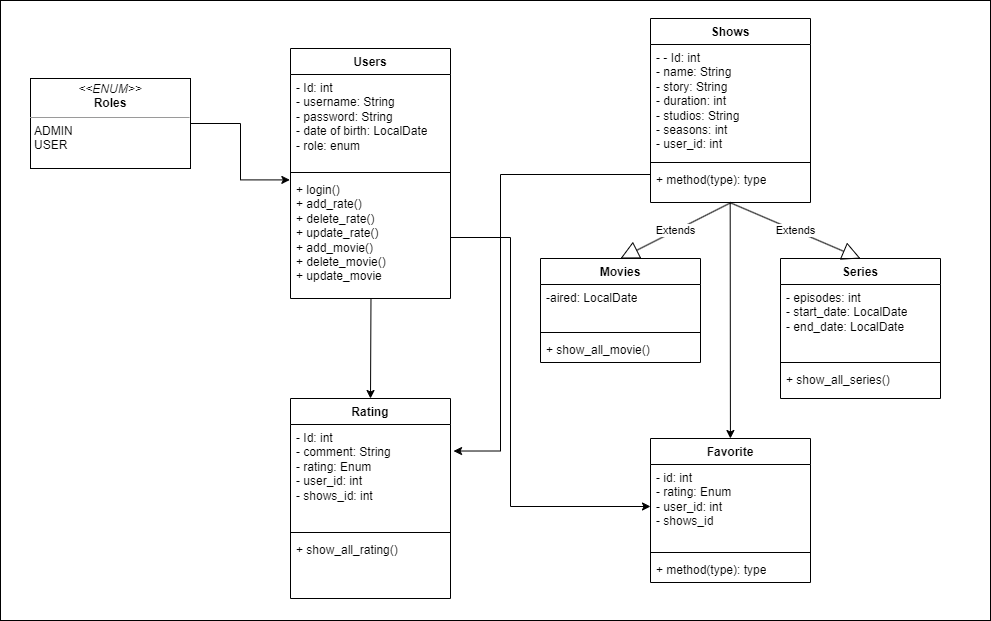

# Movie-List

## Description

Movie-List is a web application designed to manage and display a list of movies and series. It allows users to add their own ratings and reviews for each movie or series. The application provides an API for users to navigate through the movie list, also includes a user management system where users can register, login.

## Class Diagram

## Setup

1. Clone the repository to your local machine.
2. Install the necessary dependencies.  
3. Set up your MySQL database and update the `application.properties` file with your database credentials:
   
   ```
    spring.datasource.url=jdbc:mysql://localhost:3306/movielist
    spring.datasource.username=root
    spring.datasource.password=admin
    spring.datasource.driver-class-name=com.mysql.cj.jdbc.Driver
    spring.jpa.hibernate.ddl-auto=update
    spring.jpa.show-sql=true
    server.error.include-stacktrace=never
   ```
4. Import postman file from the project its have all the endpoints
5. Run the application
   
## Technologies Used
- IntelliJ IDEA: As the integrated development environment (IDE).
- Spring Web: For creating the web application.
- Spring Security: For handling user authentication and authorization.
- MySQL Workbench: For managing the database.
- Postman: For testing the API endpoints.

## API Endpoints
> **Note**
> Don't forget import the postman file from the project
### Authentication

- `POST /signup`: Register a new user. The request body should include the user's registration details in JSON format.
- `POST /signin`: Login an existing user. The request body should include the user's login credentials.
### Users

- `GET /movielist-admin/users/allusers`: Retrieve a list of all users.
- `DELETE /movielist-admin/users/deleteuser?name={name}`: Delete a user by their name. Replace `{name}` with the actual username.
- `PUT /movielist-admin/users/updateuser?name={name}`: Update a user's details. Replace `{name}` with the actual username. The request body should include the updated user details in JSON format.
### Movies

- `GET /movielist/movie/allmovies`: Retrieve a list of all movies.
- `POST /movielist-admin/movie/addmovies`: Add new movies. The request body should include the movie details in JSON format.
- `DELETE /movielist-admin/movie/deletemovie?name={name}`: Delete a movie by its name. Replace `{name}` with the actual movie name.
- `PUT /movielist-admin/movie/updatemovie?name={name}`: Update a movie's details. Replace `{name}` with the actual movie name. The request body should include the updated movie details in JSON format.
### Series

- `POST /movielist-admin/series/addseries`: Add a new series. The request body should include the series details in JSON format.
- `GET /movielist/series/allseries`: Retrieve a list of all series.
- `DELETE /movielist-admin/series/delete?name={name}`: Delete a series by its name. Replace `{name}` with the actual series name.
- `PUT /movielist-admin/series/update?name={name}`: Update a series's details. Replace `{name}` with the actual series name. The request body should include the updated series details in JSON format.
### Ratings

- `POST /movielist/rating/addrating`: Add a new rating. The request body should include the rating details in JSON format.
- `GET /movielist/rating/allrating`: Retrieve a list of all ratings.
- `DELETE /movielist/rating/delete?id={id}`: Delete a rating by its ID. Replace `{id}` with the actual rating ID.
- `PUT /movielist/rating/update?id={id}`: Update a rating's details. Replace `{id}` with the actual rating ID. The request body should include the updated rating details in JSON format.
## Extra Links
- [Trello Board](https://trello.com/b/wi9W277q/movie-list)
- [Presentation](https://docs.google.com/presentation/d/1MAeHkpOcHL-RgdyD2i5E3QJT28XKJNGuchqMLxYpn64/edit?usp=sharing)
## Future Work

In the future, I plan to extend this project in several ways:

1. **Frontend Development:** I plan to develop a frontend for this application using a modern JavaScript framework like React or Vue. This will provide users with a more interactive experience and make it easier to navigate through the movie list.

2. **Integration with External Movie Database API:** I aim to integrate an external movie database API such as The Movie Database (TMDb) or IMDb. This will allow the application to have access to a vast amount of movie data and provide users with more detailed information about each movie or series.

3. **Recommendation System:** I want to implement a recommendation system that suggests movies or series to users based on their viewing history and ratings.
## Resources
- [Baeldung Jackson Annotations Guide](https://www.baeldung.com/jackson-annotations)
- [Query Methods](https://docs.spring.io/spring-data/jpa/docs/current/reference/html/#jpa.query-methods)
- [Stack OverFlow](https://stackoverflow.com/questions/38403740/authenticate-only-selected-rest-end-points-spring-boot)
